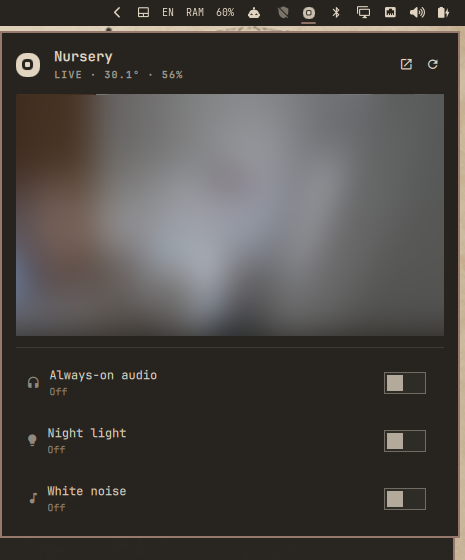

# Nanit for Omarchy

<p>
  <a href="https://github.com/GruperTal/omarchy-nanit/actions/workflows/test.yml"></a>
  <a href="LICENSE"></a>
  <a href="https://github.com/tcballard/omarchy-badges"></a>
  <a href="#compatibility"></a>
</p>

Your Nanit baby monitor in the Omarchy bar. Click the Nanit mark and the
camera plays right in the popup, with sound. Flip on always-on audio and the
nursery keeps playing while you work, after the popup closes, after a shell
restart and after a reboot. Toggle the night light and the camera's white
noise, and glance at the room's temperature and humidity.



It talks to the Nanit cloud directly through [`aionanit`](https://github.com/wealthystudent/ha-nanit),
the library behind the Home Assistant integration. No Home Assistant, no
daemon, nothing running as root.

## Requirements

- Omarchy 4 with Quattro shell-plugin support (see [Compatibility](#compatibility)).
- `qt6-multimedia-ffmpeg` (pulls `qt6-multimedia`). The shell plays the
  stream with Qt Multimedia. It is not in the Omarchy base install, so:
  `omarchy pkg add qt6-multimedia-ffmpeg`
- `mpv` and `python3`, both in the Omarchy base install.
- A Nanit account with a camera. Multi-factor authentication is supported.

## Install

```bash
omarchy pkg add qt6-multimedia-ffmpeg
omarchy plugin add https://github.com/GruperTal/omarchy-nanit.git --enable
omarchy bar move gruper.nanit --before omarchy.bluetooth   # optional placement
```

Then click the icon and choose **Log in to Nanit**. That opens a terminal,
creates a private Python venv under `~/.local/share/omarchy-nanit/` with
`/usr/bin/python3`, installs `aionanit` 1.12.2 and its dependencies from
`requirements.lock` (every package pinned, every PyPI artifact hash-verified
with `pip --require-hashes`), and asks for your email, password and the MFA
code Nanit sends you. The session is saved to
`~/.local/state/omarchy-nanit/session.json` (mode 0600) and refreshes itself
from then on. Your credentials go to Nanit's API only; the plugin never
stores your password.

## Use

| Where | Action |
|---|---|
| Bar icon, left click | open the popup: live video with sound while it is open |
| Bar icon, right click | toggle always-on audio |
| Bar icon, middle click | open or close the external mpv window |
| Header pop-out button | one mpv window, shown immediately while it connects; click again to close. In-popup audio mutes while it is open |
| Always-on audio | keeps playing after the popup closes and after a reboot; the bar icon pulses while it connects |
| Night light | camera night light |
| White noise | the camera's own sound machine |

Keys inside the popup: `j`/`k` move, `enter` activate, `l` listen,
`n` night light, `s` sound, `r` refresh, `o` mpv window, `esc` close.

IPC, for Hyprland keybindings:

```bash
omarchy-shell gruper.nanit toggleListen
omarchy-shell gruper.nanit listen on
omarchy-shell gruper.nanit light on
omarchy-shell gruper.nanit sound off
omarchy-shell gruper.nanit window
omarchy-shell gruper.nanit status
```

The CLI works on its own too: `bin/nanit status|light|sound|volume|stream|play`.

## How the stream works

The camera pushes RTMPS only while asked. `nanit stream` sends the start
request, prints the URL, and re-sends the request every five minutes until it
is killed (the camera lapses about 20 minutes after the last request). The
service plays that URL with Qt Multimedia for audio, with the video track
disabled to save CPU. The popup opens a second, muted player for the picture,
because Qt's ffmpeg backend ignores a video sink attached after playback has
started. If the stream drops, everything restarts with a fresh URL after five
seconds.

Do not pass mpv `--profile=low-latency` on this stream: it stops probing
before the AAC track shows up and you get silent video.

## Validation and tests

```bash
./tests/run
omarchy plugin validate .
```

`tests/run` checks the manifest, entry points and the CLI; it needs only
`python3` and `bash`. GitHub Actions runs it on every push.

## Update

```bash
omarchy plugin update gruper.nanit
```

## Removal

```bash
omarchy plugin remove gruper.nanit
```

That removes the plugin and its bar widget. The plugin never touches other
configuration. To also delete the venv and your saved session:

```bash
rm -rf ~/.local/share/omarchy-nanit ~/.local/state/omarchy-nanit
```

## Compatibility

Tested on Omarchy `4.0.4-1` (quickshell `0.3.1-1`, Hyprland `0.56.2-2`) on
2026-09-23, on a Dell XPS 13 9320 with two external displays, with one Nanit
Pro camera. The `4.0.0+` badge is the maintainer's declared support range for
the Quattro plugin contract, not a list of versions tested. Not tested:
standalone Sound & Light machines, accounts with several cameras (the first
camera is used), and single-display laptops.

## Security and privacy

Omarchy plugins run as unsandboxed code inside `omarchy-shell`. Review this
repository before enabling it. The plugin runs three external things:
`bin/nanit` (Python, in its own venv), `mpv` for the optional window, and a
terminal for the one-time login. Network traffic goes to `api.nanit.com` and
`media-secured.nanit.com` only. Report security problems through
[GitHub issues](https://github.com/GruperTal/omarchy-nanit/issues) or a
[private vulnerability report](https://github.com/GruperTal/omarchy-nanit/security/advisories/new).

## Third-party

- [`aionanit`](https://github.com/wealthystudent/ha-nanit/tree/main/packages/aionanit)
  (MIT) — Nanit cloud client, installed from PyPI into the plugin's venv.
  Its transitive set (`aiohttp`, `protobuf` and their dependencies) is pinned
  with hashes in `requirements.lock`, generated from PyPI's release digests.
- The Nanit name and mark belong to Nanit. This is an independent community
  plugin, not affiliated with or endorsed by Nanit.

## License

MIT © 2026 Tal Gruper
